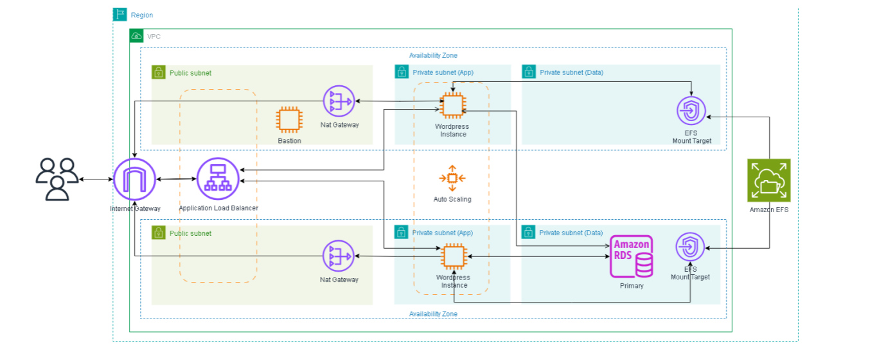

<h1 align="center">WordPress na AWS (Prod)</h1>
<p align="center"> <i>EC2 (ASG) + ALB + RDS MySQL + EFS, provisionado com <strong>Terraform</strong> e pronto para escala. </i></p>

## Visão Geral

```
Objetivo: Hospedar WordPress altamente disponivel em
EC2 com Auto Scaling atrás de ALB, com banco de dados
RDS MySQL e armazenamento de mídia no EFS
``` 
**Repositório criado 10/09/2025**


## Requisitos 

* _Terraform ≥ 1.6 (sugestão: tfenv)_
* _AWS CLI v2 autenticado (IAM User ou SSO)_
* _Permissões para criar: VPC, ALB, EC2/ASG, RDS, EFS_

### Arquitetura

 * VPC (2 AZs) → Subnets públicas (ALB/NAT) e privadas (EC2/RDS/EFS)
 * ALB (HTTP/HTTPS) → Target Group (EC2)
 * EC2 (Docker/Compose) → EFS (wp-content) e RDS (MySQL)

### Componentes & Responsabilidades

> * ALB/TG: tráfego, health-check.
> * ASG/LT: escala, user_data, AMI.
> * EC2: Docker + Compose (WordPress), montagem EFS.
> * RDS: banco gerenciado, snapshots, parâmetros.
> * EFS: conteúdo WP compartilhado.

## Informações adicionais
* O **user data** esta dentro do bloco de criação da **instancia ec2**(ec2.tf), e também dentro da instancia do **Launche Template**(launchtemplate.tf)
* O bloco de locals esta la apenas para pegar o output e conseguir utiliza-lo dentro do script do ec2
* Para o subir no git hub eu deixei o bloco de **ssh** do **bastion host** aberto para todos. É uma má pratica e caso venha utilizar em produção, altere a regra de **security group** para o seu ip privado
* Caso tenha alguma critica positiva sobre o conteudo, ou tenha duvida em algum trecho do codigo não exite em me contactar, as minhas redes de contato sempre estarão ao final do arquivo


## Variáveis Principais

**Variáveis do Terraform (tfvars):**

> * **ec2_tags** - Tags da Ec2 e do Template do Auto Scaling
> * **profile** - Seu usuario do SSO
> * **region** - Região dos serviços
> * **ami-instance** - AMI Das instancias EC2
## Arquivos e configurações
> * **username_db** - Username do usuario (Recomendo deixar "admin")
> * **db_passwd** - Senha do Banco de dados

### ec2.tf
> Aqui temos a configuração da ec2, mas para subir de maneira satisfatoria vale apena configurar alguns parametros

#### Chave ssh
A primeira modificação necessaria é configurar a chave SSH.

```
resource "aws_key_pair" "minha_chave_aws" {
  key_name   = "..."
  public_key = file("${path.module}\\caminho-da-chave-ssh)")
}
```
### SecurityGroup.tf
> Aqui temos a configuração do SG de todos serviços da AWS criada por este repositorio

### target.tf
> Aqui temos a configuração do Target do LoadBalancer

#### Quantidade de Instancia maxima do Auto Scale
Neste trecho você consegue configurar a quantidade minima e maxima de maquinas controlada pelo AutoScale

```


resource "aws_autoscaling_group" "wp" {
  name                      = "asg-wp"
  min_size                  = 2 < - Tamanho minimo
  desired_capacity          = 2
  max_size                  = 4 < - Tamanho maximo
  health_check_type         = "ELB"
  health_check_grace_period = 120 < - Periodo em que checa a Saude da Instancia

  ...
```

### launchetemplate.tf
> Aqui temos a configuração do Launcher Template da instancia

### efs.tf
> Aqui temos a configuração do EFS

## Setup
Para dar inicio a criação da infraestrutura, devemos primeiro rodar os comandos
```
terraform init
terraform plan
terraform apply
```
Caso queira desligar a infraestrutura só precisa destruilas com o comando
```
terraform destroy
```

Quando você executar os comandos "terraform apply" ou "terraform destroy" ele perguntará se você quer realmente fazer esta ação, so basta você escrever "yes". 

***Um lembrete que caso você destrua a infraestrutura do terraform com terraform destroy você perdera todos os dados do banco de dados e do efs, pois eles estão sendo criados por este codigo***

## Logar na EC2
Para logar na Instancia Bastion é simples, só precisa pegar o IP publico e fazer um ssh com a sua chave ssh
 ```
ssh -i nome-da-sua-chave ubuntu@ip-da-instancia
 ```
Agora para logar na instancia aonde rodará o WordPress você precisa fazer algumas coisas.
* Entrar na instancia Bastion
* Mover a sua a chave ssh para dentro da instancia Bastion (Você pode dar um touch e copiar o conteudo da chave privada que você registrou nas instancia para dentro da instancia EC2)
* Dar permissão para a sua chave dentro da instancia Bastion
```
cd ~/.ssh
chmod 600 nome-da-chave-ssh          # ou 400, ambos funcionam (400 é o padrão da AWS)
chmod 700 ~/.ssh
chown $USER:$USER nome-da-chave-ssh 
```
* Realizar o ssh para a instancia privada

## Entrar na pagina do Wordpress
Simples, quando você rodar o "terraform apply" ele retornara algumas informações, uma delas é o "alb_dns_name". Basta você copiar este dns acrescentar o "http://" e acessar o seu wordpress
```
http://<alb_dns_name>
```


### Informações para Contato

[](https://www.linkedin.com/in/alexsandro-ocanha-rodrigues-77149a35b/)
[](https://www.instagram.com/alexsandro.pcap/)
[](mailto:alexsandroocanha@gmail.com)
