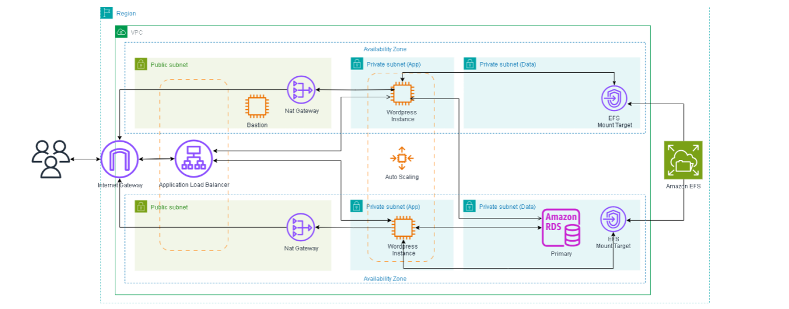

<h1 align="center">WordPress on AWS (Production)</h1>
<p align="center"> <i>EC2 (ASG) + ALB + RDS MySQL + EFS, provisioned with <strong>Terraform</strong> and designed for scalability.</i></p>

---

## Overview

```

Objective: Host a highly available WordPress environment on AWS
using EC2 with Auto Scaling behind an ALB, a managed RDS MySQL
database, and EFS for shared media storage.

````

**Repository created: 10/09/2025**

---

## Requirements

* _Terraform ≥ 1.6 (recommended: tfenv)_
* _AWS CLI v2 authenticated (IAM User or SSO)_
* _Permissions to create: VPC, ALB, EC2/ASG, RDS, EFS_

---

### Architecture



* VPC (2 AZs) → Public subnets (ALB/NAT) and private subnets (EC2/RDS/EFS)
* ALB (HTTP/HTTPS) → Target Group (EC2 instances)
* EC2 (Docker/Compose) → EFS (wp-content) and RDS (MySQL)

---

### Components & Responsibilities

> * ALB/TG: traffic routing and health checks.
> * ASG/LT: scaling, user_data execution, AMI definition.
> * EC2: Docker + Compose (WordPress) and EFS mount.
> * RDS: managed database, snapshots, parameter groups.
> * EFS: shared WordPress content storage.

---

## Additional Information

* The **user_data** script is defined inside the EC2 instance resource (`ec2.tf`) and also inside the **Launch Template** (`launchtemplate.tf`).
* The **locals block** is used only to capture outputs and reuse them inside the EC2 script.
* For GitHub deployment, the **bastion host SSH security group was left open** for demonstration purposes. This is a bad practice — in production, restrict access to your **private IP only**.
* If you have any feedback or questions about the project, feel free to contact me. My contact information is available at the end of this file.

---

## Main Variables

**Terraform variables (tfvars):**

> * **ec2_tags** - Tags for EC2 instances and Auto Scaling Group
> * **profile** - Your AWS SSO profile
> * **region** - AWS region
> * **ami-instance** - EC2 AMI ID

---

## Configuration Files

> * **username_db** - Database username (recommended: "admin")
> * **db_passwd** - Database password

---

### ec2.tf

> EC2 configuration file. Some parameters should be adjusted before deployment for better control.

#### SSH Key

The first required modification is configuring the SSH key:

```hcl
resource "aws_key_pair" "my_aws_key" {
  key_name   = "..."
  public_key = file("${path.module}\\path-to-your-ssh-key")
}
````

---

### SecurityGroup.tf

> Security group configuration for all AWS services created by this repository.

---

### target.tf

> Load Balancer target group configuration.

#### Auto Scaling Limits

This section defines the minimum and maximum number of instances managed by the Auto Scaling Group:

```hcl
resource "aws_autoscaling_group" "wp" {
  name                      = "asg-wp"
  min_size                  = 2 # minimum size
  desired_capacity          = 2
  max_size                  = 4 # maximum size
  health_check_type         = "ELB"
  health_check_grace_period = 120 # instance health check delay

  ...
}
```

---

### launchtemplate.tf

> EC2 Launch Template configuration.

---

### efs.tf

> EFS configuration file.

---

## Setup

To start provisioning the infrastructure, run:

```bash
terraform init
terraform plan
terraform apply
```

To destroy the infrastructure:

```bash
terraform destroy
```

When running `apply` or `destroy`, Terraform will ask for confirmation.
Just type `yes` to proceed.

---

⚠️ **Important note:**
Destroying the infrastructure will permanently delete all data stored in the database and EFS, since they are managed by Terraform in this setup.

---

## EC2 Access (Bastion Host)

To access the Bastion instance:

```bash
ssh -i your-key-name ubuntu@public-ip-address
```

---

To access the private WordPress instance, follow these steps:

* Connect to the Bastion host
* Move your private SSH key into the Bastion instance
* Set correct permissions for the key:

```bash
cd ~/.ssh
chmod 600 your-key-name
chmod 700 ~/.ssh
chown $USER:$USER your-key-name
```

Then SSH into the private instance.

---

## Accessing WordPress

After running `terraform apply`, one of the outputs will be `alb_dns_name`.

Open your browser and access:

```bash
http://<alb_dns_name>
```

---

## Contact Information

[](https://www.linkedin.com/in/alexsandro-ocanha-rodrigues-77149a35b/)
[](https://www.instagram.com/alexsandro.pcap/)
[](mailto:alexsandroocanha@gmail.com)
